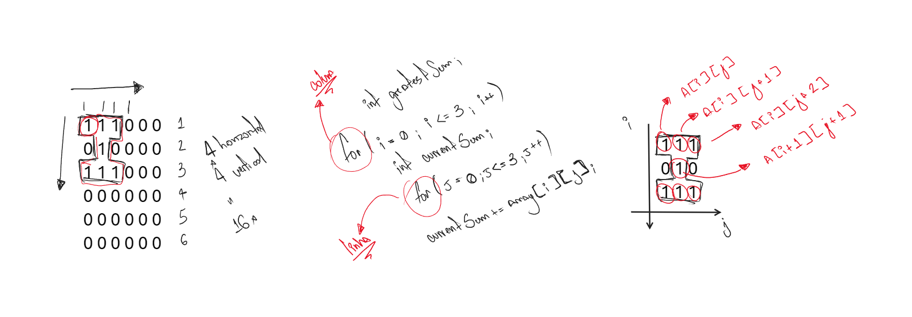

# Arrays

## Exercises

### Reverse Array Exercise

- [Algorithm](./ReverseArrayProblem.cs)

### 2D Array Exercise

- [Algorithm](./Array2D.cs)

- Explanation:

    

### Left Rotation Exercise

- [Algorithm](./LeftRotation.cs)

- Explanation:

    